# Career OS Entity Relationship Diagram Specification

**Document ID:** DB-002
**Version:** 1.0
**Status:** Draft
**Owner:** Ahmed Kazadi Kabuya
**Last Updated:** 2026-07-12

**Related Documents:**

* `docs/01-product/PRD.md`
* `docs/02-domain/DOMAIN_MODEL.md`
* `docs/02-domain/OBJECTS.md`
* `docs/02-domain/RELATIONSHIPS.md`
* `docs/02-domain/LIFECYCLES.md`
* `docs/03-architecture/ARCHITECTURE.md`
* `docs/04-database/01_DATA_DICTIONARY.md`
* `docs/09-decisions/ADR-0005-hybrid-object-registry.md`
* `docs/09-decisions/ADR-0006-hybrid-relationship-architecture.md`
* `docs/09-decisions/ADR-0007-hybrid-activity-ledger.md`
* `docs/09-decisions/ADR-0008-intelligent-ai-persistence.md`

---

# 1. Purpose

This document defines the logical Entity Relationship Diagram for Career OS.

It specifies:

* Persistent entities.
* Primary ownership boundaries.
* One-to-one relationships.
* One-to-many relationships.
* Many-to-many relationships.
* Optionality.
* Canonical foreign-key direction.
* Object Registry participation.
* Relationship-graph participation.
* Activity and lifecycle linkage.
* Integration boundaries.
* Intelligence traceability.
* Deletion and archival implications.

This document remains implementation-oriented but does not yet assign final PostgreSQL data types, index definitions, enum implementations, or Row-Level Security policies.

---

# 2. ERD Design Principles

## 2.1 Layered Object Platform

Career OS uses the following persistent layers:

1. Identity and tenancy.
2. Universal Object Registry.
3. Domain-specific records.
4. Typed relationships.
5. Activity and lifecycle history.
6. Knowledge and documents.
7. Intelligence outputs.
8. Integrations and synchronization.
9. Notifications, approvals, and audit.

## 2.2 Hybrid Object Registry

Each first-class object has:

* One row in `objects`.
* One corresponding row in its domain-specific table.

Example:

```text
objects
└── projects
```

The domain table uses the Object Registry identifier as its primary key and foreign key.

## 2.3 Hybrid Relationship Architecture

The canonical graph edge is stored in `relationships`.

Dedicated tables are also used where a relationship has:

* Important domain attributes.
* Strong referential constraints.
* High query volume.
* Meaningful lifecycle behavior.
* Transactional significance.

## 2.4 Hybrid Activity Ledger

`activities` stores the canonical event stream.

Additional specialized history tables may exist for workflows needing strongly typed state history, such as Application stages.

## 2.5 Canonical ownership

Each fact should have one authoritative entity.

Derived, indexed, cached, or projected values must not compete with the canonical source.

---

# 3. Cardinality Notation

This document uses:

```text
1      exactly one
0..1   zero or one
1..*   one or many
0..*   zero or many
```

Example:

```text
User 1 ─── 0..* Goal
```

means one User may own zero or many Goals.

---

# 4. High-Level ERD

```mermaid
erDiagram
    USERS ||--|| USER_PROFILES : has
    USERS ||--o{ USER_PREFERENCES : configures
    USERS ||--o{ OBJECTS : owns

    OBJECTS ||--o| GOALS : specializes
    OBJECTS ||--o| PROJECTS : specializes
    OBJECTS ||--o| OPPORTUNITIES : specializes
    OBJECTS ||--o| APPLICATIONS : specializes
    OBJECTS ||--o| PEOPLE : specializes
    OBJECTS ||--o| ORGANIZATIONS : specializes
    OBJECTS ||--o| KNOWLEDGE_ITEMS : specializes
    OBJECTS ||--o| DOCUMENTS : specializes
    OBJECTS ||--o| SKILLS : specializes
    OBJECTS ||--o| DECISIONS : specializes
    OBJECTS ||--o| ASSETS : specializes
    OBJECTS ||--o| INSIGHTS : specializes
    OBJECTS ||--o| RECOMMENDATIONS : specializes
    OBJECTS ||--o| CAREER_RISKS : specializes
    OBJECTS ||--o| DAILY_MISSIONS : specializes
    OBJECTS ||--o| WEEKLY_STRATEGIES : specializes
    OBJECTS ||--o| EVIDENCE : specializes

    OBJECTS ||--o{ RELATIONSHIPS : source
    OBJECTS ||--o{ RELATIONSHIPS : target
    OBJECTS ||--o{ ACTIVITIES : primary_object
    ACTIVITIES ||--o{ ACTIVITY_OBJECTS : includes
    OBJECTS ||--o{ ACTIVITY_OBJECTS : related

    OBJECTS ||--o{ LIFECYCLE_TRANSITIONS : transitions
    USERS ||--o{ LIFECYCLE_TRANSITIONS : initiates

    OBJECTS ||--o{ OBJECT_TAGS : tagged
    TAGS ||--o{ OBJECT_TAGS : applies
```

---

# 5. Identity and Tenancy ERD

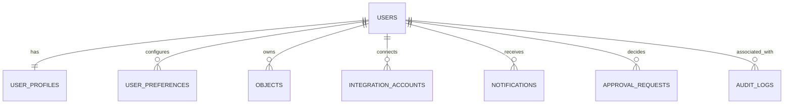

## 5.1 User to UserProfile

**Cardinality:** `User 1 ─── 1 UserProfile`

Rules:

* Each active User has one UserProfile.
* UserProfile cannot exist without User.
* Deleting a User requires a dedicated account-deletion workflow.
* UserProfile is not independently shareable.

## 5.2 User to UserPreference

**Cardinality:** `User 1 ─── 0..* UserPreference`

Rules:

* Each preference belongs to one User.
* Preference keys should normally be unique per User.
* Default values may be supplied by application configuration.

## 5.3 User to Object

**Cardinality:** `User 1 ─── 0..* Object`

Rules:

* Personal objects require an owner.
* User-scoped World objects may also have an owner in Version 1.
* System-generated Intelligence objects are created for one User.

---

# 6. Object Registry ERD

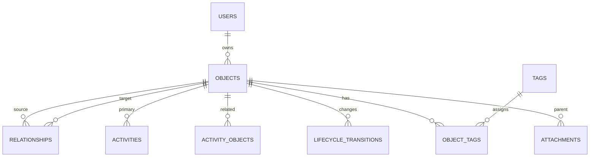

## 6.1 Object Registry specialization rule

A domain object uses:

```text
objects.id = domain_table.object_id
```

The relationship is conceptually one-to-zero-or-one from `objects` to each domain table.

An Object must map to exactly one domain table that matches its `object_type`.

Examples:

```text
object_type = project
→ exactly one projects row

object_type = person
→ exactly one people row
```

## 6.2 Registry invariants

1. Domain records cannot exist without a registry record.
2. Registry type and domain table must match.
3. Object type should be immutable.
4. Registry rows may survive archival of domain content.
5. Hard deletion requires cleanup of edges, activities, attachments, intelligence inputs, and search records.

---

# 7. Goals, Milestones, and Assets ERD

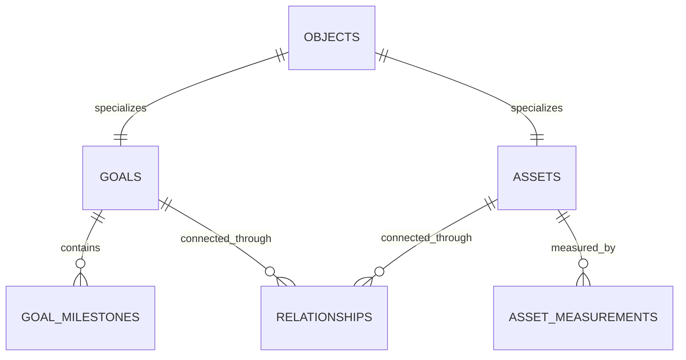

## 7.1 Goal to GoalMilestone

**Cardinality:** `Goal 1 ─── 0..* GoalMilestone`

Rules:

* Each Milestone belongs to exactly one Goal.
* Milestones are supporting records, not registered objects in Version 1.
* A Goal may exist before Milestones are created.
* Completed Milestones retain completion timestamps.

## 7.2 Asset to AssetMeasurement

**Cardinality:** `Asset 1 ─── 0..* AssetMeasurement`

Rules:

* Measurements are immutable observations.
* Measurements may be user-entered or AI-inferred.
* Inferred measurements require confidence and provenance.
* Current Asset level may be derived from the latest accepted measurement.

## 7.3 Goal to Asset

This is represented through the canonical relationship graph.

Typical edge:

```text
Goal ── DEPENDS_ON ──> Asset
```

**Cardinality:** many-to-many.

---

# 8. Decisions ERD

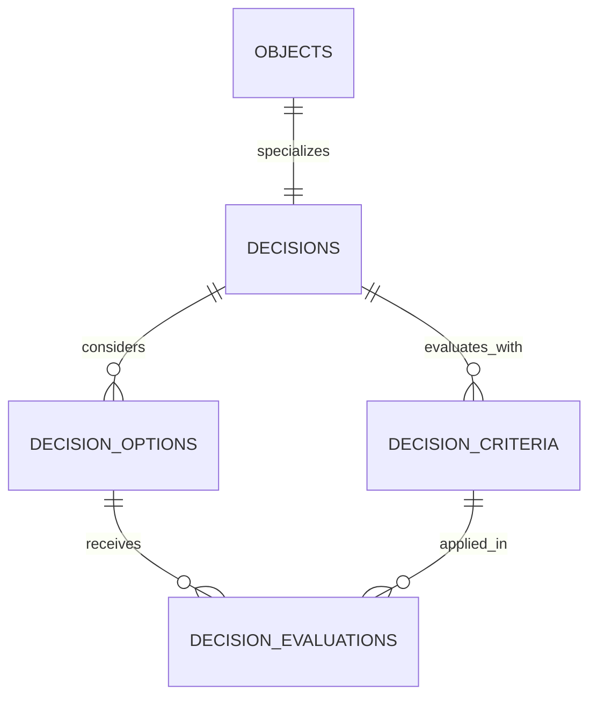

## 8.1 Decision to DecisionOption

**Cardinality:** `Decision 1 ─── 1..* DecisionOption`

Rules:

* A Decision should normally contain at least two options.
* Act-versus-do-not-act Decisions may contain exactly two implicit options.
* One Option may be selected as the final choice.
* More than one selected Option is allowed only for multi-select Decisions.

## 8.2 Decision to DecisionCriterion

**Cardinality:** `Decision 1 ─── 0..* DecisionCriterion`

Rules:

* Criteria belong to one Decision.
* Criterion weight is scoped to the Decision.
* Criteria may be manually created or AI-suggested.

## 8.3 DecisionOption to DecisionEvaluation

**Cardinality:** `DecisionOption 1 ─── 0..* DecisionEvaluation`

## 8.4 DecisionCriterion to DecisionEvaluation

**Cardinality:** `DecisionCriterion 1 ─── 0..* DecisionEvaluation`

Recommended uniqueness:

```text
decision_option_id + decision_criterion_id
```

Only one active evaluation should normally exist for each option-criterion pair, although evaluation history may be preserved separately.

---

# 9. Projects and Execution ERD

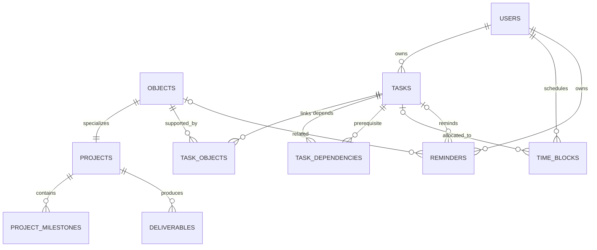

## 9.1 Project to ProjectMilestone

**Cardinality:** `Project 1 ─── 0..* ProjectMilestone`

Rules:

* Each ProjectMilestone belongs to one Project.
* Sequence order is optional but recommended.
* Milestones may carry weights for progress calculation.

## 9.2 Project to Deliverable

**Cardinality:** `Project 1 ─── 0..* Deliverable`

Deliverables are registered objects if they require:

* Independent identity.
* Search.
* Relationships.
* Attachments.
* Timeline.
* AI reasoning.

Thus:

```text
Deliverable 1 ─── 1 ObjectRegistry
```

## 9.3 Task to Object through TaskObject

**Cardinality:**

```text
Task 1 ─── 0..* TaskObject
Object 1 ─── 0..* TaskObject
```

This creates a many-to-many relationship between Tasks and Objects.

Examples:

* Task supports a Project.
* Task prepares for an Interview.
* Task is generated from a Recommendation.
* Task relates to a Person.

## 9.4 Task dependencies

`TaskDependency` is self-referential.

```text
Task 1 ─── 0..* TaskDependency
Task 1 ─── 0..* dependent TaskDependency
```

Recommended uniqueness:

```text
task_id + depends_on_task_id + dependency_type
```

A Task must not depend on itself.

Cycles should be prevented where dependency semantics require a directed acyclic graph.

## 9.5 Task to TimeBlock

**Cardinality:** `Task 0..1 ─── 0..* TimeBlock`

Rules:

* A TimeBlock may be linked to one primary Task.
* A Task may use multiple TimeBlocks.
* TimeBlocks may exist without a Task for meetings, classes, or strategic work categories.

## 9.6 Reminder relationship

A Reminder may reference:

* One Task.
* One registered Object.
* Both.
* Neither only when it is a standalone reminder.

At least one actionable target should normally be present.

---

# 10. Opportunities and Applications ERD

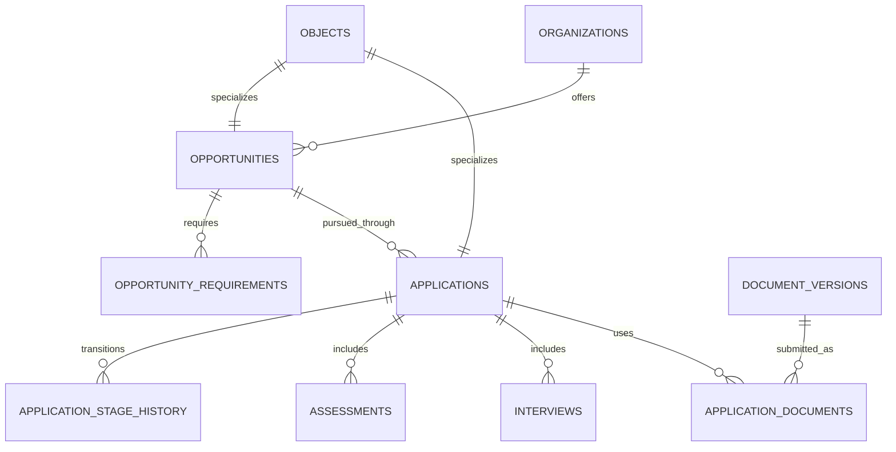

## 10.1 Organization to Opportunity

**Cardinality:** `Organization 1 ─── 0..* Opportunity`

Rules:

* Most Opportunities reference one primary Organization.
* An Opportunity may be organization-independent, such as a broad competition or public grant.
* Additional participating Organizations use the graph relationship layer.

## 10.2 Opportunity to OpportunityRequirement

**Cardinality:** `Opportunity 1 ─── 0..* OpportunityRequirement`

Rules:

* Each Requirement belongs to one Opportunity.
* Requirements may be required or preferred.
* Skill-linked requirements may additionally reference registered Skill objects through relationships.

## 10.3 Opportunity to Application

**Cardinality:** `Opportunity 1 ─── 0..* Application`

For one User:

```text
User + Opportunity
→ normally no more than one active Application
```

Historical Applications may coexist if reapplication occurs in a later cycle.

A future schema may add `application_cycle` or `cohort_year` to distinguish repeated pursuits.

## 10.4 Application to ApplicationStageHistory

**Cardinality:** `Application 1 ─── 1..* ApplicationStageHistory`

Rules:

* The initial Application state should create the first history row.
* Stage history is append-only.
* Current stage must match the latest valid history record.

## 10.5 Application to Assessment

**Cardinality:** `Application 1 ─── 0..* Assessment`

Assessments may become registered objects because they may have:

* Deadlines.
* Tasks.
* Documents.
* Calendar events.
* AI preparation.
* Independent lifecycle.

## 10.6 Application to Interview

**Cardinality:** `Application 1 ─── 0..* Interview`

Interviews are registered objects because they need:

* Independent identity.
* Participants.
* Calendar linkage.
* Preparation Tasks.
* Notes.
* Outcome.
* Timeline.

## 10.7 Application to DocumentVersion

Many-to-many through `ApplicationDocument`.

```text
Application 1 ─── 0..* ApplicationDocument
DocumentVersion 1 ─── 0..* ApplicationDocument
```

Recommended uniqueness:

```text
application_object_id
+ document_version_id
+ usage_type
```

---

# 11. People, Organizations, and Relationships ERD

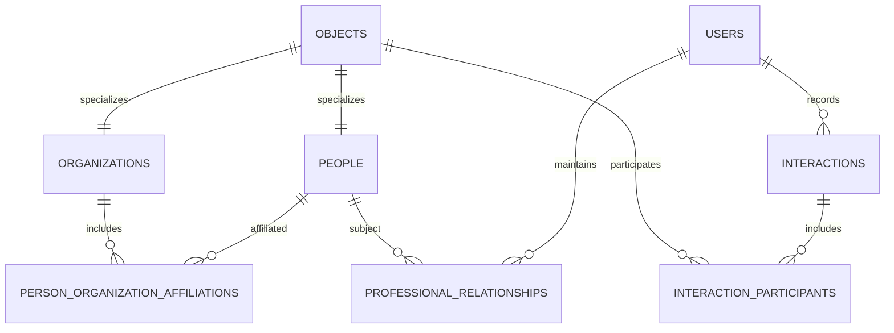

## 11.1 Person to Organization affiliation

Many-to-many through `PersonOrganizationAffiliation`.

Attributes include:

* Affiliation type.
* Title.
* Department.
* Start date.
* End date.
* Current status.

Examples:

* Works for.
* Studied at.
* Researches at.
* Advises.
* Founded.

## 11.2 User to Person professional relationship

```text
User 1 ─── 0..* ProfessionalRelationship
Person 1 ─── 0..* ProfessionalRelationship
```

Recommended uniqueness:

```text
owner_user_id + person_object_id
```

One canonical relationship record should normally exist per User-Person pair.

The detailed ontology remains available in the generic `relationships` table.

`ProfessionalRelationship` is the optimized user-specific relationship projection containing:

* Relationship lifecycle.
* Last contact.
* Follow-up.
* User notes.
* Shared interests.

## 11.3 Interaction participants

Many-to-many between Interaction and registered Objects.

Participants may include:

* People.
* Organizations.
* Opportunities.
* Applications.
* Projects.

Each participant has a role such as:

* attendee
* organizer
* interviewer
* interviewee
* mentor
* host
* related_object

---

# 12. Skills ERD

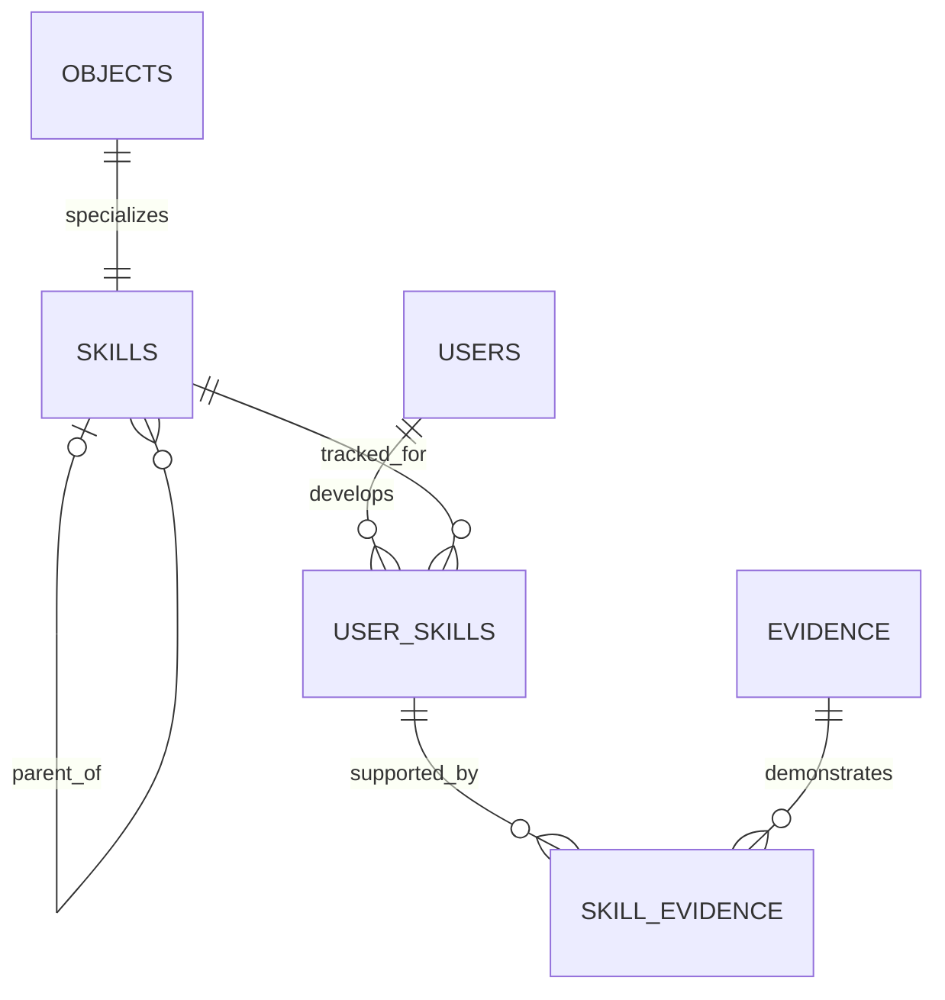

## 12.1 Skill hierarchy

Self-referential relationship:

```text
Skill 0..1 parent
Skill 0..* children
```

A Skill may have one primary parent in Version 1.

Examples:

```text
Programming
└── Python
└── TypeScript
```

## 12.2 User to Skill

Many-to-many through `UserSkill`.

`UserSkill` stores:

* Claimed level.
* Inferred level.
* Target level.
* Confidence.
* Last practiced.
* Last evaluated.

## 12.3 UserSkill to Evidence

Many-to-many through `SkillEvidence`.

One Evidence object may support multiple Skills.

One Skill claim may reference multiple Evidence objects.

---

# 13. Knowledge and Evidence ERD

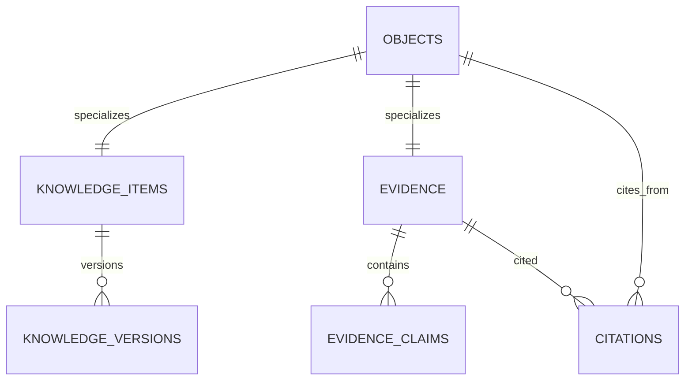

## 13.1 KnowledgeItem to KnowledgeVersion

**Cardinality:** `KnowledgeItem 1 ─── 1..* KnowledgeVersion`

Rules:

* Initial creation should produce version 1.
* KnowledgeItem may store current materialized content for convenience.
* KnowledgeVersion remains the historical authority.
* Substantial edits create new versions.

## 13.2 Evidence to EvidenceClaim

**Cardinality:** `Evidence 1 ─── 0..* EvidenceClaim`

Rules:

* Claims are atomic extractions from Evidence.
* One claim belongs to one Evidence source.
* Conflicting claims from different Evidence sources remain separate.

## 13.3 Citation

Many-to-many between registered source objects and Evidence.

Examples:

```text
KnowledgeItem ── cites ──> Evidence
Decision ── cites ──> Evidence
Insight ── supported by ──> Evidence
Recommendation ── based on ──> Evidence
Document ── references ──> Evidence
```

Recommended uniqueness may include:

```text
source_object_id
+ evidence_object_id
+ citation_role
```

---

# 14. Documents and Files ERD

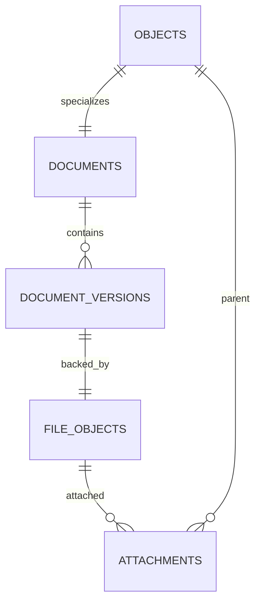

## 14.1 Document to DocumentVersion

**Cardinality:** `Document 1 ─── 1..* DocumentVersion`

Rules:

* One current version per Document.
* Historical versions are immutable.
* AI-generated revisions create new versions.

## 14.2 DocumentVersion to FileObject

Initial model:

```text
DocumentVersion 1 ─── 1 FileObject
```

A future version may support multiple files per DocumentVersion for:

* Source file.
* PDF export.
* Preview image.
* Text extraction.

## 14.3 FileObject to Attachment

A FileObject may be attached to multiple parent records only when intentional.

An Attachment references:

* A registered Object, or
* A specialized supporting record.

Polymorphic supporting-record references should be handled carefully because PostgreSQL cannot enforce all polymorphic foreign keys directly.

Preferred direction:

* Use `parent_object_id` for registered-object attachments.
* Introduce dedicated attachment-link tables for important supporting records if strong referential integrity is needed.

---

# 15. Communication and Calendar ERD

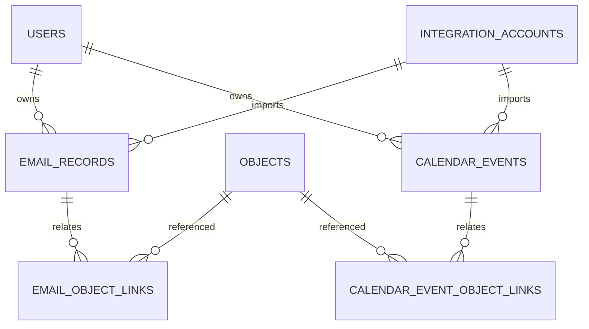

## 15.1 IntegrationAccount to EmailRecord

**Cardinality:** `IntegrationAccount 1 ─── 0..* EmailRecord`

Recommended uniqueness:

```text
integration_account_id + external_message_id
```

## 15.2 EmailRecord to Object

Many-to-many through `EmailObjectLink`.

Examples:

* Email relates to Application.
* Email sent by Person.
* Email references Opportunity.
* Email contains Interview invitation.
* Email provides Evidence.

Each link includes:

* Link type.
* Confidence.
* User confirmation.

## 15.3 IntegrationAccount to CalendarEvent

**Cardinality:** `IntegrationAccount 1 ─── 0..* CalendarEvent`

Recommended uniqueness:

```text
integration_account_id + external_event_id
```

## 15.4 CalendarEvent to Object

Many-to-many through `CalendarEventObjectLink`.

Examples:

* Event is an Interview.
* Event involves Person.
* Event supports Project.
* Event corresponds to TimeBlock.
* Event prepares for Application.

---

# 16. Intelligence ERD

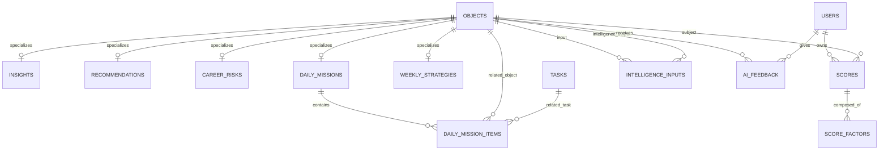

## 16.1 Intelligence object specialization

Persisted Intelligence objects requiring identity use the Object Registry.

These include:

* Insight.
* Recommendation.
* CareerRisk.
* DailyMission.
* WeeklyStrategy.

Scores remain supporting Intelligence records in Version 1 unless they require independent object capabilities.

## 16.2 Score to ScoreFactor

**Cardinality:** `Score 1 ─── 1..* ScoreFactor`

Rules:

* A persisted Score should have at least one factor.
* ScoreFactor retains rationale and optional input-object reference.
* Factor weights should not imply scientific precision unless the scoring method supports it.

## 16.3 IntelligenceInput

Many-to-many self-linking through Object Registry.

```text
Intelligence Object 1 ─── 1..* IntelligenceInput
Input Object 1 ─── 0..* IntelligenceInput
```

Rules:

* Every persisted intelligence output should have at least one input.
* Inputs may include Evidence, Goals, Projects, Tasks, Applications, People, or prior Intelligence.
* Input roles describe relevance, such as:

  * evidence
  * context
  * target
  * constraint
  * prior_output

## 16.4 DailyMission to DailyMissionItem

**Cardinality:** `DailyMission 1 ─── 1..* DailyMissionItem`

A Mission item may reference:

* One Task.
* One registered Object.
* Both.

Sequence order must be unique within a Daily Mission.

## 16.5 User feedback

`AIFeedback` belongs to one User and references one persisted Intelligence object.

A user may provide multiple feedback events over time if the output is revisited.

---

# 17. Integrations and Synchronization ERD

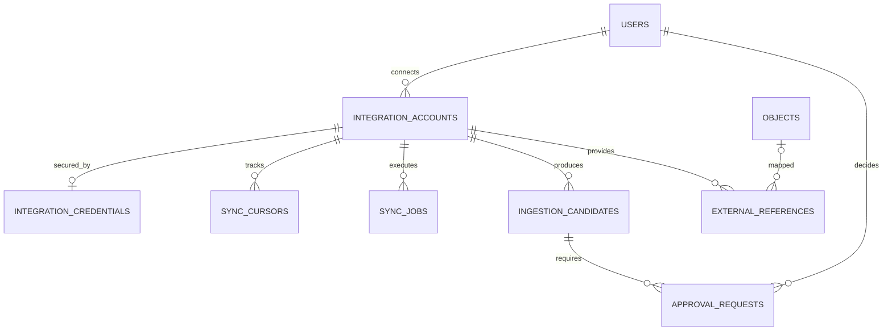

## 17.1 User to IntegrationAccount

**Cardinality:** `User 1 ─── 0..* IntegrationAccount`

A User may connect:

* Multiple Google accounts.
* GitHub.
* Other providers later.

Recommended uniqueness:

```text
owner_user_id + provider + external_account_id
```

## 17.2 IntegrationAccount to IntegrationCredential

**Cardinality:** `IntegrationAccount 1 ─── 0..1 IntegrationCredential`

Credentials may be absent when:

* Connection is disabled.
* Provider uses short-lived tokens only.
* Credential storage is delegated to another secure service.

## 17.3 IntegrationAccount to SyncCursor

**Cardinality:** `IntegrationAccount 1 ─── 0..* SyncCursor`

Recommended uniqueness:

```text
integration_account_id + resource_type
```

## 17.4 IntegrationAccount to SyncJob

**Cardinality:** `IntegrationAccount 1 ─── 0..* SyncJob`

Each execution creates a new SyncJob record.

## 17.5 IngestionCandidate to ApprovalRequest

Initial relationship:

```text
IngestionCandidate 1 ─── 0..* ApprovalRequest
```

Normally one active ApprovalRequest exists per Candidate action.

A Candidate may require separate approvals for:

* Importing content.
* Updating an Application stage.
* Creating Tasks.
* Creating Calendar events.

## 17.6 ExternalReference

ExternalReference may map:

* One external record to one registered Object.
* One external record to one supporting internal record.

Recommended uniqueness:

```text
provider
+ integration_account_id
+ external_type
+ external_id
```

---

# 18. Notifications, Audit, and Background Jobs ERD

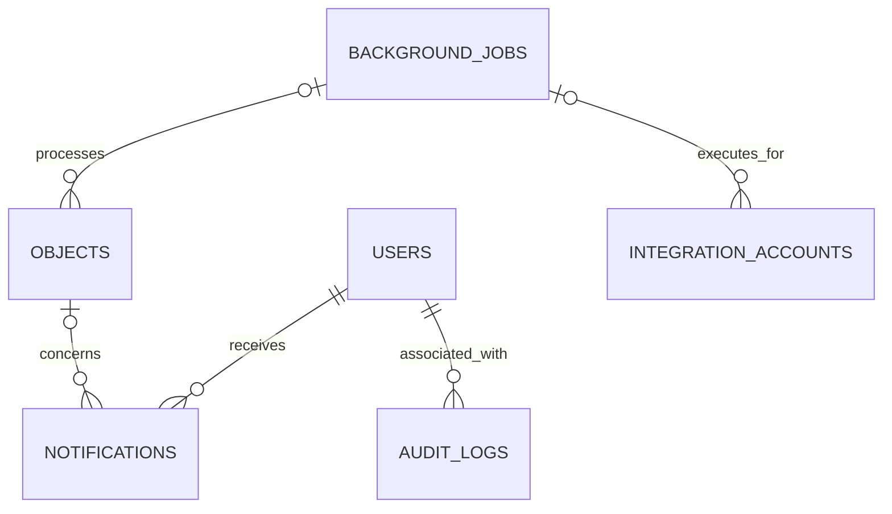

## 18.1 Notification ownership

Each Notification belongs to one User.

It may reference one registered Object.

Notifications should not own domain state.

## 18.2 AuditLog

Audit logs may reference:

* User.
* Actor.
* Target Object.
* Integration Account.
* Approval Request.
* Correlation ID.

Audit logs are append-only and security-oriented.

## 18.3 BackgroundJob

A BackgroundJob may process:

* An Integration Account.
* An Object.
* A SyncJob.
* An IngestionCandidate.
* An Intelligence refresh.

Because inputs vary, the initial design may use typed references plus validated metadata.

High-value job types may later receive dedicated job-payload tables.

---

# 19. Canonical Relationship Versus Optimized Projection

Career OS stores both generic graph relationships and selected dedicated projections.

## 19.1 Canonical graph relationships

Examples:

* Project `SUPPORTS` Goal.
* Project `BUILDS` Asset.
* Person `WORKS_FOR` Organization.
* Opportunity `REQUIRES` Skill.
* KnowledgeItem `ABOUT` Person.
* Recommendation `RECOMMENDS` Task.

These are stored in `relationships`.

## 19.2 Dedicated optimized projections

Examples:

| Domain meaning                    | Dedicated table                      |
| --------------------------------- | ------------------------------------ |
| Person works at Organization      | `person_organization_affiliations`   |
| User’s relationship with Person   | `professional_relationships`         |
| Application targets Opportunity   | `applications.opportunity_object_id` |
| Application uses Document Version | `application_documents`              |
| Task relates to Object            | `task_objects`                       |
| User proficiency in Skill         | `user_skills`                        |
| Email relates to Object           | `email_object_links`                 |
| Calendar event relates to Object  | `calendar_event_object_links`        |
| Intelligence uses input Object    | `intelligence_inputs`                |

## 19.3 Consistency policy

Each duplicated semantic relationship must designate one canonical owner.

Examples:

```text
Application → Opportunity
Canonical owner: applications.opportunity_object_id
Graph edge: derived or synchronized projection
```

```text
Person → Organization affiliation
Canonical owner: person_organization_affiliations
Graph edge: synchronized projection
```

```text
Project → Goal support
Canonical owner: relationships
No dedicated projection initially
```

The Database Schema document must identify this policy per relationship.

---

# 20. Object Registry Participation Matrix

| Entity             | Registered object? | Notes                               |
| ------------------ | -----------------: | ----------------------------------- |
| User               |                 No | Authentication and tenancy identity |
| UserProfile        |                 No | Extension of User                   |
| Goal               |                Yes | First-class Personal object         |
| GoalMilestone      |                 No | Supporting record                   |
| Decision           |                Yes | First-class Personal object         |
| DecisionOption     |                 No | Supporting record                   |
| Asset              |                Yes | First-class Personal object         |
| Project            |                Yes | First-class Personal object         |
| ProjectMilestone   |                 No | Supporting record                   |
| Deliverable        |                Yes | Independent project output          |
| Task               |       No initially | Supporting execution record         |
| TimeBlock          |       No initially | Supporting schedule record          |
| Opportunity        |                Yes | First-class World object            |
| Application        |                Yes | First-class Personal object         |
| Assessment         |                Yes | Independent evaluation workflow     |
| Interview          |                Yes | Independent scheduled workflow      |
| Person             |                Yes | First-class World object            |
| Organization       |                Yes | First-class World object            |
| Skill              |                Yes | Reusable World object               |
| KnowledgeItem      |                Yes | First-class Personal object         |
| Evidence           |                Yes | Source-backed object                |
| Document           |                Yes | First-class Personal object         |
| DocumentVersion    |                 No | Supporting immutable version        |
| FileObject         |                 No | Storage record                      |
| Insight            |                Yes | Durable Intelligence object         |
| Recommendation     |                Yes | Durable Intelligence object         |
| Score              |       No initially | Supporting Intelligence record      |
| CareerRisk         |                Yes | Durable Intelligence object         |
| DailyMission       |                Yes | Durable Intelligence object         |
| WeeklyStrategy     |                Yes | Durable Intelligence object         |
| EmailRecord        |                 No | Restricted integration record       |
| CalendarEvent      |                 No | Integration/supporting record       |
| IntegrationAccount |                 No | Infrastructure record               |
| IngestionCandidate |                 No | Pipeline record                     |
| ApprovalRequest    |                 No | Workflow record                     |
| Notification       |                 No | User communication record           |
| AuditLog           |                 No | Security record                     |

---

# 21. Ownership Boundaries

## 21.1 Personal entities

Must include `owner_user_id`, directly or through Object Registry.

Examples:

* Goal.
* Project.
* Application.
* Decision.
* Knowledge Item.
* Document.
* Asset.
* Intelligence output.

## 21.2 World entities

Version 1 uses user-scoped World entities.

Examples:

* Person.
* Organization.
* Opportunity.
* Skill.
* Evidence.

This avoids premature global entity resolution and cross-user privacy complexity.

Future shared World objects require a new ADR and migration strategy.

## 21.3 Integration entities

Always belong to one User through IntegrationAccount or direct ownership.

## 21.4 Supporting records

Must resolve ownership unambiguously through:

* Direct `owner_user_id`, or
* Parent object ownership, or
* IntegrationAccount ownership.

---

# 22. Required Uniqueness Constraints

Logical uniqueness requirements include:

```text
user_profiles.user_id
```

```text
user_preferences:
user_id + preference_key
```

```text
professional_relationships:
owner_user_id + person_object_id
```

```text
object_tags:
object_id + tag_id
```

```text
task_dependencies:
task_id + depends_on_task_id + dependency_type
```

```text
application_documents:
application_object_id + document_version_id + usage_type
```

```text
decision_evaluations:
decision_option_id + decision_criterion_id
```

```text
integration_accounts:
owner_user_id + provider + external_account_id
```

```text
sync_cursors:
integration_account_id + resource_type
```

```text
email_records:
integration_account_id + external_message_id
```

```text
calendar_events:
integration_account_id + external_event_id
```

```text
external_references:
integration_account_id + provider + external_type + external_id
```

```text
daily_mission_items:
daily_mission_object_id + sequence_order
```

Additional partial uniqueness constraints will be defined in `03_DATABASE_SCHEMA.md`.

---

# 23. Deletion and Archival Relationships

## 23.1 Archive over delete

First-class objects should normally be archived rather than deleted.

## 23.2 User account deletion

Deleting a User requires coordinated handling of:

* Personal objects.
* User-scoped World objects.
* Relationships.
* Activities.
* Integration credentials.
* Files.
* Email records.
* Calendar records.
* Intelligence outputs.
* Audit retention requirements.

## 23.3 Object deletion

A hard-deleted Object must not leave invalid references in:

* Relationships.
* ActivityObject.
* ObjectTag.
* TaskObject.
* Attachments.
* Citations.
* IntelligenceInput.
* Notifications.
* ExternalReference.

## 23.4 Evidence preservation

Deleting an Evidence object may affect:

* Knowledge verification.
* Insights.
* Recommendations.
* Scores.
* Decisions.

The system should warn the user about dependent intelligence before deletion.

## 23.5 Integration disconnection

Disconnecting an IntegrationAccount should:

* Revoke or delete credentials.
* Stop SyncJobs.
* Preserve or delete imported records according to user choice.
* Mark external references unavailable where appropriate.
* Retain approved Career OS objects unless the user requests deletion.

---

# 24. Privacy Boundaries

## Restricted entity groups

* IntegrationCredential.
* EmailRecord.
* AuditLog.
* Sensitive FileObject.
* Immigration-related Evidence.
* Trading-related records when introduced.
* Private contact information.

## Inherited privacy

The following inherit the highest sensitivity of their connected inputs:

* Insight.
* Recommendation.
* Score.
* CareerRisk.
* DailyMission.
* AIFeedback.
* IntelligenceInput.

## Relationship privacy

A Relationship may be more sensitive than either endpoint.

Example:

```text
User ── INTERESTED_IN_CONTACTING ──> Person
```

Therefore, relationship access must not be determined only by endpoint visibility.

---

# 25. Core Query Paths Supported by the ERD

The model must support:

## Mission Control

* Today’s incomplete Tasks.
* Today’s Calendar Events.
* Upcoming deadlines.
* High-priority Applications.
* Actionable Email Records.
* Follow-up Relationships.
* Active Career Risks.
* Daily Mission Items.

## Application context

From an Application retrieve:

* Opportunity.
* Organization.
* Requirements.
* Contacts.
* Emails.
* Interviews.
* Assessments.
* Documents used.
* Tasks.
* Stage history.
* Recommendations.
* Activities.

## Person context

From a Person retrieve:

* Organization affiliations.
* Professional Relationship.
* Interactions.
* Emails.
* Opportunities.
* Projects.
* Knowledge.
* Follow-up Tasks.
* Relationship intelligence.

## Goal context

From a Goal retrieve:

* Projects.
* Opportunities.
* Assets.
* Skills.
* Milestones.
* Tasks.
* Risks.
* Recommendations.
* Decisions.
* Progress Activities.

## AI traceability

From a Recommendation retrieve:

* Input objects.
* Evidence.
* Score factors.
* Related Goal.
* User feedback.
* Resulting Tasks.
* Outcome Activities.

---

# 26. Mermaid ERD — Core MVP

```mermaid
erDiagram
    USERS ||--|| USER_PROFILES : has
    USERS ||--o{ USER_PREFERENCES : sets
    USERS ||--o{ OBJECTS : owns

    OBJECTS ||--o{ RELATIONSHIPS : source
    OBJECTS ||--o{ RELATIONSHIPS : target
    OBJECTS ||--o{ ACTIVITIES : primary
    ACTIVITIES ||--o{ ACTIVITY_OBJECTS : links
    OBJECTS ||--o{ ACTIVITY_OBJECTS : related
    OBJECTS ||--o{ LIFECYCLE_TRANSITIONS : history

    OBJECTS ||--|| GOALS : goal
    GOALS ||--o{ GOAL_MILESTONES : milestones

    OBJECTS ||--|| PROJECTS : project
    PROJECTS ||--o{ PROJECT_MILESTONES : milestones
    PROJECTS ||--o{ DELIVERABLES : produces

    USERS ||--o{ TASKS : owns
    TASKS ||--o{ TASK_OBJECTS : links
    OBJECTS ||--o{ TASK_OBJECTS : concerns
    TASKS ||--o{ TIME_BLOCKS : scheduled

    OBJECTS ||--|| ORGANIZATIONS : organization
    OBJECTS ||--|| PEOPLE : person
    PEOPLE ||--o{ PERSON_ORGANIZATION_AFFILIATIONS : affiliated
    ORGANIZATIONS ||--o{ PERSON_ORGANIZATION_AFFILIATIONS : includes

    USERS ||--o{ PROFESSIONAL_RELATIONSHIPS : maintains
    PEOPLE ||--o{ PROFESSIONAL_RELATIONSHIPS : subject

    USERS ||--o{ INTERACTIONS : records
    INTERACTIONS ||--o{ INTERACTION_PARTICIPANTS : includes
    OBJECTS ||--o{ INTERACTION_PARTICIPANTS : participates

    OBJECTS ||--|| OPPORTUNITIES : opportunity
    ORGANIZATIONS ||--o{ OPPORTUNITIES : offers
    OPPORTUNITIES ||--o{ OPPORTUNITY_REQUIREMENTS : requirements

    OBJECTS ||--|| APPLICATIONS : application
    OPPORTUNITIES ||--o{ APPLICATIONS : pursued
    APPLICATIONS ||--o{ APPLICATION_STAGE_HISTORY : history
    APPLICATIONS ||--o{ ASSESSMENTS : assessments
    APPLICATIONS ||--o{ INTERVIEWS : interviews

    OBJECTS ||--|| DOCUMENTS : document
    DOCUMENTS ||--o{ DOCUMENT_VERSIONS : versions
    DOCUMENT_VERSIONS ||--|| FILE_OBJECTS : file
    APPLICATIONS ||--o{ APPLICATION_DOCUMENTS : uses
    DOCUMENT_VERSIONS ||--o{ APPLICATION_DOCUMENTS : applied_with

    OBJECTS ||--|| KNOWLEDGE_ITEMS : knowledge
    KNOWLEDGE_ITEMS ||--o{ KNOWLEDGE_VERSIONS : versions

    OBJECTS ||--|| EVIDENCE : evidence
    EVIDENCE ||--o{ EVIDENCE_CLAIMS : claims
    OBJECTS ||--o{ CITATIONS : cites
    EVIDENCE ||--o{ CITATIONS : cited

    OBJECTS ||--|| SKILLS : skill
    USERS ||--o{ USER_SKILLS : develops
    SKILLS ||--o{ USER_SKILLS : tracked
    USER_SKILLS ||--o{ SKILL_EVIDENCE : supported
    EVIDENCE ||--o{ SKILL_EVIDENCE : demonstrates

    OBJECTS ||--|| RECOMMENDATIONS : recommendation
    OBJECTS ||--|| INSIGHTS : insight
    OBJECTS ||--|| CAREER_RISKS : risk
    OBJECTS ||--|| DAILY_MISSIONS : mission

    OBJECTS ||--o{ INTELLIGENCE_INPUTS : input
    OBJECTS ||--o{ INTELLIGENCE_INPUTS : output
    DAILY_MISSIONS ||--o{ DAILY_MISSION_ITEMS : contains

    USERS ||--o{ INTEGRATION_ACCOUNTS : connects
    INTEGRATION_ACCOUNTS ||--o| INTEGRATION_CREDENTIALS : credentials
    INTEGRATION_ACCOUNTS ||--o{ SYNC_CURSORS : cursor
    INTEGRATION_ACCOUNTS ||--o{ SYNC_JOBS : jobs

    INTEGRATION_ACCOUNTS ||--o{ EMAIL_RECORDS : emails
    EMAIL_RECORDS ||--o{ EMAIL_OBJECT_LINKS : links
    OBJECTS ||--o{ EMAIL_OBJECT_LINKS : related

    INTEGRATION_ACCOUNTS ||--o{ CALENDAR_EVENTS : events
    CALENDAR_EVENTS ||--o{ CALENDAR_EVENT_OBJECT_LINKS : links
    OBJECTS ||--o{ CALENDAR_EVENT_OBJECT_LINKS : related

    INTEGRATION_ACCOUNTS ||--o{ INGESTION_CANDIDATES : candidates
    USERS ||--o{ APPROVAL_REQUESTS : approves

    USERS ||--o{ NOTIFICATIONS : receives
    USERS ||--o{ AUDIT_LOGS : audits
```

---

# 27. Deferred ERD Decisions

The following remain unresolved until `03_DATABASE_SCHEMA.md`:

1. Whether Tasks should later become registered objects.
2. Whether TimeBlocks should become registered objects.
3. Whether Scores require Object Registry identity.
4. Whether Evidence should be globally shared.
5. Whether Deliverables require a dedicated domain table or use Document/Project relationships.
6. Whether polymorphic attachments are acceptable.
7. Whether Activities need a dedicated actor table.
8. Whether lifecycle status is stored only on domain tables or additionally on Object Registry.
9. Whether ApplicationStageHistory and LifecycleTransition both remain necessary.
10. Whether generic relationships are stored alongside all dedicated projections or generated on demand.
11. Whether deleted object identifiers remain tombstoned in Object Registry.
12. Whether object slugs are unique per User, per object type, or globally.
13. Whether AI input graphs need version snapshots.
14. Whether email body storage uses a separate encrypted entity.
15. Whether shared search documents require a dedicated indexing table.

---

# 28. ERD Acceptance Criteria

The ERD is ready for schema design when:

* Every MVP entity has an ownership path.
* Every first-class object maps through Object Registry.
* All many-to-many relationships have a linking entity or canonical graph edge.
* Application history is reconstructable.
* Object timelines are reconstructable.
* AI outputs are traceable to inputs.
* Google integration records map to internal objects.
* Approval-gated actions are representable.
* Document versions and file storage are separated.
* Sensitive entities have clear privacy boundaries.
* Deletion dependencies are identified.
* Canonical ownership is unambiguous.
* Core Mission Control queries are supported.
* The design can be implemented in PostgreSQL without requiring a graph database.

---

# 29. Next Documents

* `docs/04-database/03_DATABASE_SCHEMA.md`
* `docs/04-database/04_INDEXING_STRATEGY.md`
* `docs/04-database/05_RLS_POLICIES.md`
* `docs/04-database/06_MIGRATION_STRATEGY.md`
* `docs/04-database/07_NAMING_CONVENTIONS.md`

